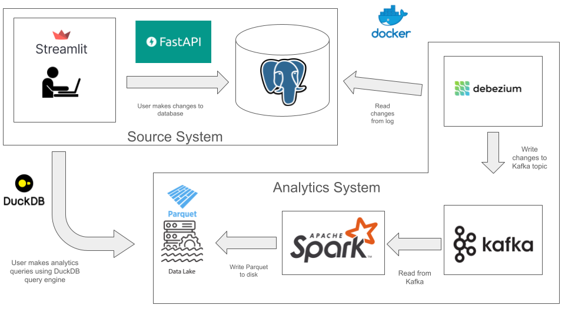

# MigsbyU

## Introduction

This repository contains a fully-contained source application that simulates the operations of a university's course management portal. The frontend service 
allows you to register students, professors, and courses at the university, as well as enroll students in courses and assign professors to teach courses.
You can generate random data, add your own, or update existing records to reflect changes in real-life (e.g. students increase their GPA, change their address, etc.)

The analytics component of this application is enabled by capturing all historical information provided by the operational database, and representing them as a Type 2 Slowly Changing Dimensions.


## Architecture

Behind the scenes, new data generated (or changes made to existing data) is passed into an API call which subsequently makes changes to the underlying operational database, hosted with PostgreSQL. The operational database is normalized, as is the norm with OLTP databases, to reduce data redundancies and increase read/write efficiency.

To enable analytics on the managed data I have developed a CDC (change data capture) pipeline that captures all historical information from the operational database and stores it in a separate OLAP database. This process begins with Debezium and Kafka, which have been set up and configured to read changes from the OLAP database and write to a Kafka topic - one topic per table. The changes are then persisted to disk using Spark structured streaming, which reads from the Kafka topics and writes the streaming DataFrame as a parquet file to the "data_lake". Finally, DuckDB is used as the query engine to display the results in the frontend application.

This architecture minimizes additional stress on the operational database, as the Debezium connector reads changes from PostgreSQL's write ahead log (wal) instead of querying the database directly. Additionally, the structured stream allows for changes made in the OLTP database to be reflected in the OLAP database as close to real-time as possible.




## Installation
* Requires: `Git`, `Docker`

Download:

```bash
git clone git@github.com:flemm0/MigsbyU.git
```

Run:
```bash
cd MigsbyU

docker compose up --build -d
```

Acess the UI at: http://localhost:8501

Done playing:
```bash
docker compose down --rmi all
```